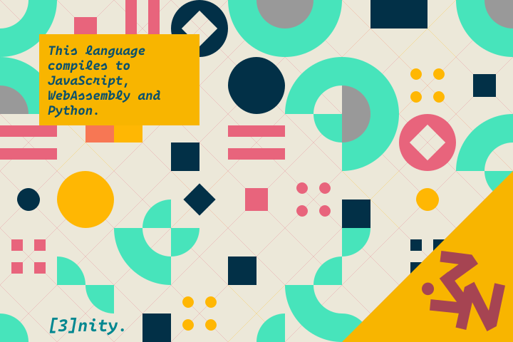

# [3nity](https://github.com/noxventura/3nitylang)

> The programming language for the future.



**_3nity_** is a multi-paradigm, multi-platform language that enables developers to **build**, **test**, **deploy**, **scale** and **maintain** software.

- A familiar but less noisy/salty syntax makes it easier to write beautiful and expressive code, while flattening the learning curve.
- Comprehensive APIs tied to every runtime make it easy to run programs and integrate with vast ecosystems of software and libraries.
- Built-in markup, styles, routing, queries and schemas allow you to use the language on the entire stack.
- Static type checking, program verification and useful error messages make it easy to catch or remediate errors and suppress potential harmful behaviour.

```dart
elem B-Block(&text: Str) as b-block {
  pub field text: Str = text || ''

  async def onHover(e) {
    text = text.replace(`\b[bgkmpt]`gi, "\xe533")
  }

  style :host {
    display: block
    color: red
    font-family: ["Roboto", "Arial", "Helvetica", "sans-serif"]
    font-weight: 900
    font-size: 1px
    :hidden {
      display: none
    }
  }

  stat def render = <span>$text</span>
}
```

### Roadmap

> Update: I have a [Trello](https://trello.com/b/A3NDX7qY/3nity-programming-language) now!

- **Grammar** (see [`grammar.yaml`](https://github.com/NoxVentura/3nityLang/blob/main/grammar.yaml))
- Documentation (language and API)
- Language reference
- Lexer and parser
- Trans-compiler
- Tooling (VSCode, Atom and Nova)
- Theme, branding and website

## Overview

Learning a new programming language is hard: new toolchains to download, frameworks and tools to learn, and APIs to memorize. And in each domain, the languages performing best would long surpass other languages that will soon follow. The insurgence of new, modern and fully-featured languages like Rust, Kotlin and Go, would break these.

JavaScript was no different. Given the circumstances that made it, it was not designed to be used for more complex projects such as enterprise-scale software. Still, people kept on pushing for new ideas and developing tools for them, and those got incorporated into the language and its ecosystem. However, it would not (yet) change the way we fundamentally think about JavaScript.

The language is flawed, as many would point out. The lack of types would yield somewhat crazy results, some of which could ["turn our everyday job into a nightmare"][wtfjs]. Projects get bloated with hundreds, if not thousands of NPM packages in order to work and run smoothly, resulting in increasingly laggy build times.

[wtfjs]: https://github.com/denysdovhan/wtfjs/
[go]: https://golang.org/
[kotlin]: https://kotlinlang.org/
[rust]: https://www.rust-lang.org/
[rescript]: https://rescript-lang.org/
[scala]: https://www.scala-lang.org/
[swift]: https://swift.org/
[typescript]: https://www.typescriptlang.org/
[flix]: https://flix.dev/
[reasonml]: https://reasonml.github.io/
[mint]: https://mint-lang.com/
[fantom]: https://fantom.org/
[dart]: https://dart.dev/
[react]: https://reactjs.org/

## Table of Contents

3nity is a multi-purpose, multi-paradigm and multi-platform language I'm creating to hopefully replace JavaScript and its runtime, to serve its domains, and to make the language better. With it, you could write apps, games and more, without the need for setting up or installing dependencies.

Learning from other languages like [Scala][scala], [Dart][dart], [Fantom][fantom], [Rust][rust], [ReScript][rescript], [Flix][flix], [React][react] and [Go][go], 3nity functions as both a framework and compiler to allow developers to write faster, expressive and error-free code for the entire stack, all with the same programming language.

---

This reference is a work in progress and will be improved over time. See the GitHub repository at https://github.com/NoxVentura/3nityLang. Contributions and corrections are welcome.

A lot of my work on 3nity is still experimental and ongoing, so I am sharing this repository so I could get all of my ideas together and perhaps invite some of you to contribute your own. Once I get done with it, we can begin work on the compiler.

### A little disclaimer

As of now, 3nity does not have a language spec. This document will describe 3nity in terms of its textual rendering into source code.

3nity will be implemented in JavaScript.

#### Text encoding

3nity only encodes text in UTF-8; other encodings are not supported. Any of the standard line termination sequences can be used, depending on the platform: `\r`, `\n` or `\r\n`.

#### File types

3nity has only three file types: module (`*.3n`), script (`*.3s`).

The entry point of a 3nity module is defined in the `main` function. This makes it easy to reason about startup behavior.

Module files are the default. This allows easy importing, exporting and accessing other modules. You can put anything into them, such as stylesheets, web components, constants, types and functions.

```dart
/// @file main.3n
func main(*args: []Str): Void { /*...*/ }
```

The type annotations or the spread `*args` declaration can be left out, so it can be `func main {}` instead.

Script files do not have a `main` function, similar to batch or Bash files. Script files can import module files, and can run other script files externally.

```dart
print("Hello", params(1))
exit(42)
```

## Syntax

### Some Guidelines

#### Syntax

Like JavaScript, 3nity is a curly-brace language. Code blocks are delimited usually with curly braces.

Semicolons are completely optional though they can be used to separate multiple statements on the same line. The same rules apply to commas in function arguments or collection literals.

If a line ends in an **infix operator**, such as `!in` or `&&`, or otherwise explicitly with `\`, the resultant line is joined. If the next line also begins with an infix operator, it is joined to the previous line.

```dart
x +  // joined
y

x // joined
+ y
```

#### Comments

3nity supports C-style comments. Comments `/+` and `/++` can be nested.

```dart
// line comment
/* block comment */
/+ nested comment +/
/// line comment
/** block comment */
/++ nested comment +/
```

### Variable bindings

A variable binding, or otherwise a declaration, begin with any one of `var`, `val`, `let` or `const`. All bindings are "scoped" to the block in which they are defined in, and all inner blocks.

```dart
var x = 42
val y: Int = 42
y = 10
```

`let` and `const` bindings can be redeclared, even on the same scope.

```dart
let x = 1
let x = 2 // x is now 2
```

### Assigning multiple variables

There are many ways to assign variables:

```dart
let x, y, z = 1, a = 2
x = 1; y = 2
```

You can also unpack them from regular expressions or data structures:

```dart
let `(?'x'.+)` = 'a' // x == 'a'

let (x, y) = (1, 2) // seq
let [x, y] = [1, 2] // list
let {x, y} = {x: 1, y: 2} // map
let {x, y} = {1, 2} // set
```

### Keywords

The following are all the keywords of the language. Keywords are grouped into four different categories: operator keywords, declaration keywords, modifier keywords, and control keywords.

As for modifier keywords, they are parsed as keywords before a declaration as they modify them. `pub var x = 1` declares a public variable.

<!--  -->

    in of as is new to til thru by del unset

    var val let const decl def func type object
    class enum module pack struct inter space pragma
    proc proto macro given style elem field
    ext pred data trait lemma iter sub prop

    pub priv prot inline final mut immut ghost early late joint contra
    seal abs intern extern imply exply global local
    async sync stat dyn lazy eager strong weak swap
    vol unsafe unfix bound free opaque trans
    rec gen oper get set post put rem new del patch
    prefix suffix infix binary unary left right

    if un elif elun else then
    for each loop while until when
    with do from
    try throw catch final
    switch match case fail
    race some every done spawn kill lock
    break next redo retry return await label yield goto pass
    import export using
    debug assert where

An identifier should not begin with any number of keywords in any order as mentioned above, otherwise it is a syntax error. This is a special case both for the grammar and the parser.

### Identifiers

3nity defines an identifier as any sequence of letters, digits, combining marks, underscores (Unicode `Pc`) and dashes (Unicode `Pd`), provided that it starts with a letter or underscore, and does not end in any number of trailing dashes.

The regular expression is:

```js
const regex = /\b[\p{Pc}\p{L}][\d\p{L}\p{M}\p{Pc}\p{Pd}]*\b/;
```

#### Naming conventions

3nity recognizes four different kinds of naming conventions:

- Leading underscores: `__dirname` or `__main__`
- All-uppercase: `PACKED-DECIMAL` or `T_SL`
- First character uppercase: `IOStream`, `Get-Variable` or `UnityEngine`
- First character lowercase: `split`, `bit-or` or `toString`.

#### Identifier Comparison

Variables are compared using their first character, then comparing further characters case-insensitively and ignoring all non-alphanumeric characters.

This approach, called "partial case insensitivity", makes it easier for developers to use varying conventions without having to worry about the variables' exact spelling.

```dart
func transform(x) = x[1:].sub(`\p{Alnum}`g, '').lower()
proc cmpIdent(a: Str, b: Str): Bool = a[0] == b[0] && transform(a) == transform(b)
```

All keywords are written in all lowercase. To strop them, add one or more trailing underscores.

Keywords also lose their meaning when they are part of a qualified name, such as a key, property or method.

```dart
type Type = {
  def: Func
}

val object_ = new Type({def: |x| x = 10})
assert object_ is Type
assert object_.def == 9

var var_ = 42
val val_ = 8
assert var_ + let_ == 50

val assert_ = true
assert assert_
```

## Data Types

3nity has all the data types you would expect from a programming language: booleans, numbers, strings, null values, collections, regexps, among others. All data types are immutable.

### Booleans, Null and Void

`Null` and `void` are one and the same.

```dart
null; void
assert null == void
assert null == void
```

A boolean can only have one of two values: `true` or `false`. Booleans are mainly used for control flow, and there are a lot of operators that return boolean values.

```dart
true; false
```

When cast into booleans, anything that suggests something is empty, such as 0, the empty string, list, set, etc. All others yield `true`.

### Numbers

3nity supports three data types, all 64-bit. This avoids a lot of complexity associated with numeric precision such as file lengths, Unicode strings or very large lists.

```dart
val integer: Int = 123
val floating: Float = 0x12.345
```

Numbers are case insensitive. They can contain leading zeroes or underscores for easy readability (of course, after the prefix).

Literals can be written in base 2, 4, 6, 8, 10, 12 or 16:

```dart
val base2 = 0b10
val base4 = 0q123
val base6 = 0s12345
val base8 = 0o1234567
val base10 = 0123456789
val base12 = 0z0123456789ab
val base16 = 0x0123456789abcdef
```

Floating-point numbers can allow different kinds of delimiters and separators.

```dart
0.3 // Basic literal (3/10)
3/10 // Fraction
0.~3 // Repeating digits
1^10 // Exponent
1^-10 // Signed exponent
0.1*16^+10 // Scientific notation
1=10 // Rounding
1=+10 // Round up
1=-10 // Round down
1=!-10 // Significant figures
```

A type suffix is an identifier after the numeric literal, in order to explicitly specify its type.

### Strings

Strings are delimited by matching quotes. Just like in YAML, only double quoted strings can contain escape sequences. Single quoted strings are _raw_, which means that they do not interpret any escape sequences.

```dart
var s1 = 'Single quotes work well for string literals.'
var s2 = "Double quotes work just as well."
```

To escape a single quote, double it.

```dart
var voidDaughter = 'Kai''Sa'
```

Double quoted string literals can contain the following escape sequences, and can contain the following escape sequences:

| Escape Sequence | Meaning                                        |
| --------------- | ---------------------------------------------- |
| `\p`            | platform specific newline (`\r\n`, `\n`, `\r`) |
| `\r`            | carriage return (`\x9`)                        |
| `\n`            | line feed (or newline) (`\xA`)                 |
| `\f`            | form feed (`\xC`)                              |
| `\t`            | horizontal tabulator (`\x9`)                   |
| `\v`            | vertical tabulator (`\xB`)                     |
| `\a`            | alert (`\x7`)                                  |
| `\b`            | backspace (`\x8`)                              |
| `\e`            | escape (`\xB`)                                 |
| `\s`            | space (`\x20`)                                 |

3nity also supports escapes in even bases up to 16, excluding 14.

| Escape Sequence      | Meaning                                        |
| -------------------- | ---------------------------------------------- |
| `\b` (beside 0 or 1) | _Base 2_ - from `0` to `100001111111111111111` |
| `\q`                 | _Base 4_ - from `0` to `10033333333`           |
| `\s` (beside 0 to 5) | _Base 6_ - from `0` to `35513531`              |
| `\o`                 | _Base 8_ - from `0` to `4177777`               |
| `\d` or `\`          | _Base 10_ - from `0` to `1114111`              |
| `\z`                 | _Base 12_ - from `0` to `4588A7`               |
| `\x`                 | _Base 16_ - from `0` to `10FFFF`               |
| `\u`                 | UTF-8, 16 or 32 code units only                |
| `\j`                 | Named Unicode characters and LaTeX expressions |

The same escapes with curly brackets allow you to insert many code points inside, with each character or code unit separated by spaces. Only `\j` requires curly brackets.

```dart
// "HELLO"
"\x48\x45\x4c\x4c\x4f" == "\x{48 45 4c 4c 4f}"
"\d{72 69 76 76 69}" == "\72\69\76\76\79"
```

In single quoted strings, to escape single quotes, double them.

```dart
var s3 = 'It''s easy to escape the string delimiter.'
var s4 = "It's even easier to use the other delimiter."
```

In double-quoted strings, an ending backslash joins the next line _without spaces_.

```dart
assert "hello \
        world" == "hello world"
```

#### Block strings

String literals can also be delimited by at least three single or double quotes, provided they end with _at least_ that many quotes of the same type.

The rules for single- and double-quoted strings also apply.

```dart
'''
  "stringified string"
'''
""" "stringified string""""
```

produces:

    "stringified string"

All newlines and whitespace before the first non-line character and after the last non-line character are discarded.

All indentation is determined based on the first line of text (the first non-whitespace character). All indentation after that column is preserved while those before it are discarded.

Newlines are normalized to `\n`.

```dart
'''
"stringified
  string"
''' ==
"""
  "stringified
    string"
"""
```

Any string that does not obey this rule is a compile-time error.

```dart
"""
  "stringified
string"
"""
```

### String Manipulation

3nity comes with several avenues to make manipulating, formatting and serializing strings easier.

#### String Interpolation

All forms of string literals, with exception to inline backslash strings, can enable embedding of arbitrary expressions. Embedded expressions are prefixed with the dollar and surrounded by curly brackets.

If the expression is an identifier or qualified name, then the brackets can be left out. Use the `\$` escape sequence if you wish to express the dollar sign itself.

```dart
"x is $x, in hex $x.toHex, and x+8 is ${x + 8}"
```

is syntax sugar for:

```dart
"x is " + x + ", in hex " + x.toHex + ", and x+8 is " + (x + 8)
```

The hash sign takes several arguments, as placeholders, passed to the `format` method. Arguments can either be named, numbered or keyed.

```dart
'#0%s is #1 meters tall'.format('James', 1.9)
// "James is 1.9 meters tall"
```

#### Format Directives

3nity provides an extensive string formatting mini-language for converting, transforming, transl(iter)ating and serialising strings. Its syntax derives from Command Prompt.

They are composed of the following parts:

- A command: `%command` denoted by a percentage sign
- An optional range of switches, each denoted by a slash `/switch`,
- Their optional values, separated by a colon: `/sw:value`.

```dart
const prices = { bread: 4.50 }
'I like bread. It costs $prices.bread%f/cur:"SGD".'
// "I like bread. It costs $4.50."
```

#### Macro Strings

Macro strings are used to embed domain-specific languages directly into 3nity, and are functionally the same as tagged template literals. The construct `name"string"` or `name("string")`, denotes a macro call with a string as its own argument.

A macro function is defined with the keyword `macro` rather than `fun`. The first argument of a `macro` contains a list of intermediate strings, the second being the interpolated values or placeholders, and the third being the formatting metadata.

```dart
macro template(strings, keys) = |*values| {
  val dict = values[-1] ?? {}
  val values = from val key in keys
    select if key is Int: values[key]
    else: dict[key]
  values = values as List
  return strings.intercalate(keys).join('')
}

val t1Closure = template"${0}${1}${0}!"
assert t1Closure("Y", "A") == "YAY!"
val t2Closure = template"${0} ${"foo"}!"
assert t2Closure("Hello", {foo: "World"}) == "Hello World!"
```

### Regular expressions

Regular expressions function like strings, except delimited using backticks `` ` `` as opposed to quotes. Regular expressions allow free spacing and embedded comments. Escaping rules apply though between `()` and `[]` the backtick itself need not be escaped.

Escaping rules apply, though in between brackets the backtick need not be escaped. Interpolation and formatting also applies but the interpolated result is usually escaped so to prevent generating invalid regular expressions.

3nity uses the [Oniguruma](https://github.com/kkos/oniguruma) regular expression flavor by default, the same regex engine that powers Ruby and PHP7. But it adds its own extensions and will be (re)implemented in 3nity.

```dart
`\b{wb}(fee|fie|foe|fum)\b{wb}`x
`[ ! @ " $ % ^ & * () = ? <> ' : {} \[ \] `]`x
`
  \/\* // Match the opening delimiter.
  .*?  // Match a minimal number of characters.
  \*\/ // Match the closing delimiter.
`
```

Multi-quoted and block regular expressions are also supported.

````dart
```(?/
  <<= | >>= | #= | \*\*=
  | \+= | -= | /= | \@=
  | \*= | %= | ~= | \^= | \&= | \|=
  | =(?!=) \p{is Latin}
)```

\< x
  (?:[a-zA-Z_]|(?:\\u[0-9a-fA-F]{4}|\\U[0-9a-fA-F]{8}))(?:[a-zA-Z0-9_]|(?:\\u[0-9a-fA-F]{4}|\\U[0-9a-fA-F]{8}))*(?=:)
````

If there are two adjacent regular expression literals on one side, then the one on the right is the substitution (template) string for the regular expression on the left.

```dart
val str = 'James Bond'
val newStr = str =< `(\w+)\W+(\w+)` `$2, $1` // 'Bond, James'
val newStr = str =< `(\w+)\W+(\w+)` `My name is $2, $0!`
// 'My name is Bond, James Bond'
```

The following section serves as a summary to the regular expression syntax of 3nity, as well as some of the more unique features that Nova has over other regex flavors.

#### Basic Syntax Elements

| Syntax      | Description                                     |
| ----------- | ----------------------------------------------- |
| `\`         | Escape (disable) a metacharacter                |
| `\|`        | Alternation                                     |
| `/`         | Alternation: try out matches in the given order |
| `(...)`     | Capturing group                                 |
| `[...]`     | Character class (can be nested)                 |
| `${...}`    | Embedded expression                             |
| `{,}`       | Quantifier token (LHS 0, RHS &infin;)           |
| `"..."`     | Raw quoted literal                              |
| `'...'`     | Quoted literal                                  |
| `\0` onward | Numeric back-reference (0-indexed)              |
| `$...%...`  | String interpolation syntax                     |
| `#...`      | String anchor syntax                            |

#### Characters

Most of these characters also appear the same way as in string literals.

| Syntax                         | Description and Use                       |
| ------------------------------ | ----------------------------------------- |
| `\a`                           | \*Alert/bell character (inside `[]`)      |
| `\b`                           | \*Backspace character (inside `[]`)       |
| `\e`                           | Escape                                    |
| `\f`                           | Form feed                                 |
| `\n`                           | New line                                  |
| `\r`                           | Carriage return                           |
| `\t`                           | Horizontal tab                            |
| `\v`                           | Vertical tab                              |
| `\cA`...`\cZ`<br>`\ca`...`\cz` | Control character (from `U+01` to `U+1A`) |

The following can only be used inside square brackets.

| Syntax               | Description and Use                            |
| -------------------- | ---------------------------------------------- |
| `\b` (beside 0 or 1) | _Base 2_ - from `0` to `100001111111111111111` |
| `\q`                 | _Base 4_ - from `0` to `10033333333`           |
| `\s` (beside 0 to 5) | _Base 6_ - from `0` to `35513531`              |
| `\o`                 | _Base 8_ - from `0` to `4177777`               |
| `\d` or `\`          | _Base 10_ - from `0` to `1114111`              |
| `\z`                 | _Base 12_ - from `0` to `4588A7`               |
| `\x`                 | _Base 16_ - from `0` to `10FFFF`               |

#### Character Sequences

Character sequences in regular expressions are the same as in their string counterparts, with exception to `\b{}` outside `[]`.

#### Character Classes and Sequences

| Syntax | Inverse | Description                                                       |
| ------ | ------- | ----------------------------------------------------------------- |
| `.`    | None    | Hexadecimal code point (1-8 digits)                               |
| `\w`   | `\W`    | Word character `[\d]`                                             |
| `\d`   | `\D`    | Digit character `[0-9]`                                           |
| `\s`   | `\S`    | Space character `[\t\n\v\f\r\20]`                                 |
| `\h`   | `\H`    | Hexadecimal digit character `[\da-fA-F]`                          |
| `\u`   | `\U`    | Uppercaseter `[A-Z]`                                              |
| `\l`   | `\L`    | Lowercaseter `[a-z]`                                              |
| `\f`   | `\F`    | Form feed `[\f]`                                                  |
| `\t`   | `\T`    | Horizontal tab `[\t]`                                             |
| `\v`   | `\V`    | Form feed `[\v]`                                                  |
| `\n`   | `\N`    | Newline `[\n]`                                                    |
|        | `\O`    | Any character `[^]`                                               |
| `\R`   |         | General line break (CR + LF, etc)                                 |
| `\c`   | `\C`    | First character of identifier; `[\pL\pPc]` by default             |
| `\i`   | `\I`    | Subsequent characters of identifier `[\pL\pPc\pM\pNd]` by default |
| `\x`   | `\X`    | Extended grapheme cluster                                         |

##### Unicode Properties

Properties are case-insensitive. Logical operators `&&`, `||`, `^^` and `!`, can be interspersed to express compound queries.

| Syntax                        | Description                                   |
| ----------------------------- | --------------------------------------------- |
| `\p{p=v}`<br>`\p{p==v}`       | `prop` equals `value`                         |
| `\p{p!=v}`<br>`\P{p=v}`       | `prop` does not equal `value`                 |
| `\p{p^=v}`                    | `prop` begins with but does not equal `value` |
| `\p{p$=v}`                    | `prop` ends with but does not equal `value`   |
| `\p{p*=v}`                    | `prop` contains but does not equal `value`    |
| `\p{p\|=v}`                   | `prop` begins with or equals to `value`       |
| `\p{p~=v}`                    | `prop` ends with or equals to `value`         |
| `\p{p&=v}`                    | `prop` contains or equals to `value`          |
| `\p{in Blk}`<br>`\P{!in Blk}` | Block property                                |
| `\p{is Scr}`<br>`\P{is! Scr}` | Script or binary property                     |
| `\p{value}`                   | Short form\*                                  |
| `\p{Cc}`                      | Unicode character categories^                 |

\*Properties are checked in the order: `General_Category`, `Script`, `Block`, binary property:

- `Latin` &rarr; (`Script==Latin`).
- `BasicLatin` &rarr; (`Block==BasicLatin`).
- `Alphabetic` &rarr; (`Alphabetic==Yes`).

##### POSIX Classes

Alternatively, `\p{}` notation can be used instead of `[:]`.

| Syntax      | ASCII                                        | Unicode (`/u` flag) | Description                                              |
| ----------- | -------------------------------------------- | ------------------- | -------------------------------------------------------- |
| `[:alnum]`  | `[a-zA-Z0-9]`                                | `[\pL\pNl}\pNd]`    | Alphanumeric characters                                  |
| `[:alpha]`  | `[a-zA-Z]`                                   | `[\pL\pNl]`         | Alphabetic characters                                    |
| `[:ascii]`  | `[\x00-\x7F]`                                | `[\x00-\xFF]`       | ASCII characters                                         |
| `[:blank]`  | `[\x20\t]`                                   | `[\pZs\t]`          | Space and tab                                            |
| `[:cntrl]`  | `[\x00-\x1F\x7F]`                            | `\pCc`              | Control characters                                       |
| `[:digit]`  | `[0-9]`                                      | `\pNd`              | Digits                                                   |
| `[:graph]`  | `[\x21-\x7E]`                                | `[^\pZ\pC]`         | Visible characters (anything except spaces and controls) |
| `[:lower]`  | `[a-z]`                                      | `\pLl`              | Lowercaseters                                            |
| `[:number]` | `[0-9]`                                      | `\pN`               | Numeric characters                                       |
| `[:print]`  | `[\x20-\x7E] `                               | `\PC`               | Printable characters (anything except controls)          |
| `[:punct]`  | `[!"\#$%&'()\*+,\-./:;<=>?@\[\\\]^\_'{\|}~]` | `\pP`               | Punctuation (and symbols).                               |
| `[:space]`  | `[\pS\t\r\n\v\f]`                            | `[\pZ\t\r\n\v\f]`   | Spacing characters                                       |
| `[:symbol]` | `[\pS&&[:ascii]]`                            | `\pS`               | Symbols                                                  |
| `[:upper]`  | `[A-Z]`                                      | `\pLu`              | Uppercaseters                                            |
| `[:word]`   | `[A-Za-z0-9_]`                               | `[\pL\pNl\pNd\pPc]` | Word characters                                          |
| `[:xdigit]` | `[A-Fa-f0-9] `                               | `[A-Fa-f0-9]`       | Hexadecimal digits                                       |

#### Character Sets

A set `[...]` can include nested sets. The operators below are listed in increasing precedence, meaning they are evaluated first.

| Syntax                 | Description                                                    |
| ---------------------- | -------------------------------------------------------------- |
| `^...`, `~...`, `!...` | Negated (complement) character class                           |
| `x-y`                  | Range (from x to y)                                            |
| `\|\|`                 | Union (`x \|\| y` &rArr; "x or y")                             |
| `&&`                   | Intersection (`x && y` &rArr; "x and y" )                      |
| `^^`                   | Symmetric difference (`x ^^ y` &rArr; "x and y, but not both") |
| `--`                   | Difference (`x ~~ y` &rArr; "x but not y")                     |

#### Anchors

| Syntax | Inverse | Description                                  |
| ------ | ------- | -------------------------------------------- |
| `^`    | None    | Beginning of the string/line                 |
| `$`    | None    | End of the string/line                       |
| `\b`   | `\B`    | Word boundary                                |
| `\a`   | `\A`    | Beginning of the string/line                 |
| `\z`   | `\Z`    | End of the string/before new line            |
|        | `\G`    | Where the current search attempt begins/ends |
|        | `\K`    | Keep start/end position of the result string |
| `\m`   | `\M`    | Line boundary                                |
| `\y`   | `\Y`    | Text segment boundary                        |

#### Quantifiers

| Syntax           | Reluctant `?` (returns shortest match) | Possessive `+` (returns nothing) | Greedy `*` (returns longest match) | Description                             |
| ---------------- | -------------------------------------- | -------------------------------- | ---------------------------------- | --------------------------------------- |
| `?`              | `??`                                   | `?+`                             | `?*`                               | 1 or 0 times                            |
| `+`              | `+?`                                   | `++`                             | `+*`                               | 1 or more times                         |
| `*`, `{,}`, `{}` | `*?`, `{,}?`, `{}?`                    | `*+`, `{,}+`, `{}+`              | `**`, `{,}*`, `{}*`                | 0 or more times                         |
| `{n,m}`          | `{n,m}?`                               | `{n,m}+`                         | `{n,m}*`                           | At least `n` but no more than `m` times |
| `{n,}`           | `{n,}?`                                | `{n,}+`                          | `{n,}*`                            | At least `n` times                      |
| `{,m}`           | `{,m}?`                                | `{,m}+`                          | `{,m}*`                            | Up to `m` times                         |
| `{n}`            | `{n}?`                                 | `{n}+`                           | `{n}*`                             | Exactly `n` times                       |

#### Groups

`(?'')`, `(?"")` notation can also be used.

| Syntax                      | Description                       |
| --------------------------- | --------------------------------- |
| `(?#...)`                   | Comment                           |
| `(?x-y:...)`<br>`(?x-y)...` | Mode modifier                     |
| `(?:...)`                   | Non-capturing (passive) group     |
| `(...)`                     | Capturing group (numbered from 1) |
| `(?<name>...)`              | Named capturing group             |
| `(?<-x>...)`                | Balancing group                   |
| `(?<x-x>...)`               | Balancing group pair              |
| `(?=...)`                   | Positive lookahead                |
| `(?!...)`                   | Negative lookahead                |
| `(?<=...)`                  | Positive lookbehind               |
| `(?<!...)`                  | Negative lookbehind               |
| `(?>...)`                   | Atomic group (no backtracking)    |
| `(?~...)`                   | Sub-expression                    |
| `(?()\|...\|...)`           | Conditional branching             |
| `(?~\|...\|...)`            | Absent expression                 |
| `(?~\|...)`                 | Absent repeater                   |
| `(?~...)`                   | Absent stopper                    |
| `(?~\|)`                    | Range clear                       |

#### Backreferences and Calls

`\k''`, `\k""` can also be used.

| Syntax     | Description                                               |
| ---------- | --------------------------------------------------------- |
| `\1`       | Specific numbered backreference                           |
| `\k<1>`    | Specific numbered backreference                           |
| `\k<-1>`   | Relative numbered backreference (`+` ahead, `-` behind)   |
| `\k<name>` | Specific named backreference                              |
| `\g<1>`    | Specific numbered subroutine call                         |
| `\g<-1>`   | Relative numbered subroutine call (`+` ahead, `-` behind) |
| `\g<name>` | Specific named subroutine call                            |

#### Flags

These flags go after the regex literal. `f`, `m`, `u`, `e` and `x` are enabled by default.

| Flag | Description                                                                  |
| ---- | ---------------------------------------------------------------------------- |
| `a`  | Astral mode - Unicode quotes support code points past the BMP                |
| `c`  | Case-sensitive mode                                                          |
| `d`  | Treat only `\n` as a line break                                              |
| `e`  | Safe mode - escape all interpolations                                        |
| `g`  | Global. Enabled by default                                                   |
| `i`  | Case-insensitive mode                                                        |
| `j`  | Switches definitions of `()` and `(?:)`                                      |
| `k`  | Allows duplicate named groups                                                |
| `l`  | Last match only                                                              |
| `m`  | Multiline - `^`/`$` match at every line                                      |
| `n`  | Named capturing groups only - all unnamed groups become non-capturing        |
| `o`  | Unsafe mode - coerces interpolations into strings                            |
| `p`  | `^` and `$` match at the start/end of line                                   |
| `q`  | Quote all metacharacters                                                     |
| `s`  | Dotall --- `.` matches all characters                                        |
| `t`  | Strict spacing mode                                                          |
| `u`  | Unicode mode - POSIX class definitions also expanded                         |
| `w`  | `^` and `$` match at the start/end of string, `.` does not match line breaks |
| `x`  | Free-spacing mode                                                            |
| `y`  | Sticky mode - search begins from specified index on LHS of regex             |

#### Replacement String

This syntax applies to the second regex literal onward in regex operations such as substitution and transliteration. If any group referenced in the index before is invalid group, it is inserted literally.

| Syntax    | Meaning                                                                        |
| --------- | ------------------------------------------------------------------------------ |
| `$$`      | Inserts a literal "$".                                                         |
| `$0`      | Inserts the entire matched substring into the output.                          |
| `$-`      | Inserts the portion of the string that precedes the matched substring.         |
| `$+`      | Inserts the portion of the string that follows the matched substring.          |
| `$n`      | Where `n` is a positive integer, inserts the `n`th submatch.                   |
| `$<name>` | Where name is a capturing group name, inserts the submatch assigned to `name`. |

## Collections

3nity comes with four different collection literals: lists `[]`, sets `{}`, maps `{:}`. All collection literals are immutable. A `Mut` prefix on its type or a hash `#` right before the literal makes them mutable, and allows you to mutate them directly.

### Lists

Lists are indexed collections of values, are surrounded by square brackets and each element is separated by commas.

The type signature of a list is `List[Value]` or `{}Value`.

```dart
var x: []Int = [10, 20, 30]
var y = [\a, \b, \c] // is []Str
```

The type of the list uses the postfix curly bracket notation, where you can explicitly specify the type of the list.

```dart
var z = [10, '20', '30']{Str|Int} // with type casting operator
```

If the type is omitted, then type inference is used to determine the type of the items. The type of the items is determined by taking the union type of all the elements of the list. For example:

```dart
assert [1, 2, 3] is []Nat &&
  [1, null, 3] is []?Nat &&
  [1., 2., 3.] is []Float &&
  [1, -2, 3] is []Int &&
  [1, "2", 3] is [](Nat|Str) &&
  [1, 2, 3]{Num} is []Num &&
  [[10, 20], [30]] is [][]Int
```

Often the compiler will infer a list to have a non-nullable type. If the list might store `null` or `void` values, then you will need to explicitly cast it.

```dart
[1, 2, 3] // cannot store null
[1, 2, 3, null]{?Nat} // can store null
```

The empty list is denoted using the special syntax `[]`. Often you will specify a type - for example `[]{Str}` is an empty list of strings. If a type is not specified, then the empty list evaluates to a `[]{Any}`.

### Sets

Sets are ordered collections of unique, distinct elements, and are surrounded by curly brackets, with each element is separated by commas.

The type signature of a set is `Set[Key]` or `{}Key`.

```dart
var x: {}Int = {10, 20, 30}
var y = {\a, \b, \c} // is []Str
var z = {10, '20', '30']{Str|Int}
```

If the type is omitted, then type inference is used to determine the type of the items. The type of the items is determined by taking the union type of all the elements of the list. For example:

```dart
assert {1, '2', 3, :4} is {}(Int|Str|Sym)
```

The empty set is denoted using the special syntax `{}`. If the type is not specified, the set is automatically `{}{Any}`.

### Maps

Maps are keyed collections of unique elements, surrounded by curly brackets like sets. Each key is unique and is assigned to a non-distinct value, separated by a colon. Pairs are separated by commas, just like lists and sets.

```dart
var x: {Int : Str} = {1: 'one', 2: 'two'}
var y = {3: 'three', 4: 'four'} // is []Str
var z = {10, '20', '30'}{Str : Int}
```

The type signature of a map is `Map[Key, Value]` or `{Key : Value}`. Note the colon is spaced out on both sides. `{Key: Value}` is a map with the string value `Key` which can hold the type `Value`.

The type of keys are determined as follows:

- If a key is a constant, i.e. `true`, `false`, `null`, `void`, `infin` or `nan`, it will be parsed as its value.
- If a key can be parsed as a number it is a number.
- If a key begins with `:`, `'`, `"`, `:'`, `:"`, `` ` ``, `[`, `(`, `{`, `#[`, `#(`, `#{`, it would not be treated as an unquoted string.
- ANy other ihtirh

The empty map is denoted using the special syntax `{:}` so not to be confused with the empty set syntax. If there is no explicit type, it is inferred to be `{Any : Any}`.

Note that maps may not be typed with a nullable key. If you are using type inference, you might need to explicitly type a map which will store null:

```dart
{1: 'one', 2: 'two'} // cannot store null
{1: 'one', 2: 'two'}{Int : ?Str} // now it can
```

### Symbols

A symbol represents a unique name inside the entire source code. Symbols are interpreted at compile time and cannot be created dynamically.

The only way to create a symbol is by using a symbol literal, denoted by a colon (`:`) followed by an unquoted string beginning with a word character, and follows the same rules as an unquoted string.

The identifier may optionally be enclosed in single or double quotes.

```dart
:unquoted_symbol
:"quoted symbol"
:"a" // identical to :a
:あ
```

A quoted identifier can contain any Unicode character including white-spaces and can same escape sequences as a string literal, including interpolation. Use interpolation to create dynamic keys.

```dart
:question?
:exclamation!
```

## Expressions

3nity's expression syntax is very similar to C, PHP, Java, Elixir, Haskell and others. 3nity has built-in operators:

### Operators

The tables below define all of 3nity's operators, and you can define your own.

#### General operators

| Operator | Type    | Meaning                         |
| -------- | ------- | ------------------------------- |
| `!`      | Unary   | Assert that not null            |
| `?`      | Unary   | Exists                          |
| `.`      | Binary  | Basic access                    |
| `::`     | Binary  | Dynamic access                  |
| `!.`     | Binary  | Assertive access                |
| `!:`     | Binary  | Assertive dynamic access        |
| `?.`     | Binary  | Optional access                 |
| `?:`     | Binary  | Optional dynamic assign         |
| `.=`     | Binary  | Access-assignment               |
| `::=`    | Binary  | Dynamic access-assign           |
| `!.=`    | Binary  | Assertive access-assign         |
| `!:=`    | Binary  | Assertive dynamic access-assign |
| `?.=`    | Binary  | Optional access-assign          |
| `?:=`    | Binary  | Optional dynamic access-assign  |
| `??`     | Infix   | Basic access                    |
| `!!`     | Infix   | Dynamic access                  |
| `?:`     | Infix   | Assertive access                |
| `!:`     | Infix   | Assertive dynamic access        |
| `? :`    | Ternary | Conditional                     |
| `! :`    | Ternary | Inverse conditional             |
| `$ :`    | Ternary | Infix function call             |

#### Numeric operators

| Operator     | Type   | Meaning                          |
| ------------ | ------ | -------------------------------- |
| `+`          | Prefix | Numeric casting                  |
| `+`          | Suffix | Successor                        |
| `+`          | Infix  | Add                              |
| `-`          | Prefix | Negation                         |
| `-`          | Suffix | Previous number                  |
| `-`          | Infix  | Subtract                         |
| `*`          | Infix  | Multiply                         |
| `**`, `@*`   | Infix  | Exponent                         |
| `***`, `@**` | Infix  | Exponent with integer rounding   |
| `/`          | Infix  | Divide                           |
| `#`          | Infix  | Divide with integer rounding     |
| `%`          | Infix  | Remainder (Python, R)            |
| `%%`         | Infix  | Unsigned remainder (C, Java, JS) |
| `~`          | Prefix | Bitwise not                      |
| `&`          | Infix  | Bitwise and                      |
| `\|`         | Infix  | Bitwise or                       |
| `^`          | Infix  | Bitwise exclusive or             |
| `<<`         | Infix  | Bitwise signed left shift        |
| `>>`         | Infix  | Bitwise signed right shift       |
| `<<<`        | Infix  | Bitwise unsigned left shift      |
| `>>>`        | Infix  | Bitwise unsigned right shift     |
| `<`          | Infix  | Lesser than                      |
| `<=`         | Infix  | Lesser than or equal to          |
| `>`          | Infix  | Greater than                     |
| `>=`         | Infix  | Greater than or equal to         |
| `==`         | Infix  | Equal to                         |
| `!=`, `<>`   | Infix  | Not equal to                     |
| `<=>`        | Infix  | Three-way comparison             |
| `*>`         | Infix  | Minimum                          |
| `<*`         | Infix  | Maximum                          |

#### String operators

| Operator | Type  | Meaning           |
| -------- | ----- | ----------------- |
| `+`      | Infix | Concatenation     |
| `-`      | Unary | Reversal          |
| `~=`     | Infix | Matching          |
| `~!`     | Infix | Negative matching |
| `*`      | Infix | Repetition        |
| `/`      | Infix | Splitting         |
| `#`      | Unary | Length            |

#### Logical operators

| Operator | Type  | Meaning              |
| -------- | ----- | -------------------- |
| `&&`     | Infix | Logical and          |
| `\|\|`   | Infix | Logical or           |
| `^^`     | Infix | Logical exclusive or |
| `!`      | Unary | Logical not          |
| `~>`     | Infix | Imply                |
| `<~`     | Infix | Backwards imply      |
| `<~>`    | Infix | Bothward imply       |

#### Function operators

| Operator  | Type  | Meaning                    |
| --------- | ----- | -------------------------- |
| `+>`      | Infix | Composition                |
| `\|>`     | Infix | Pipeline                   |
| `\|\|>`   | Infix | Iterable pipeline          |
| `\|\|\|>` | Infix | Async pipeline             |
| `<+`      | Infix | Backward composition       |
| `<\|`     | Infix | Backward pipeline          |
| `<\|\|`   | Infix | Backward iterable pipeline |
| `<\|\|\|` | Infix | Backward async piping      |

#### Collection operators

| Operator | Type  | Meaning                 |
| -------- | ----- | ----------------------- |
| `+`      | Infix | Push or unshift         |
| `++`     | Infix | Concatenate             |
| `-`      | Unary | Pop or shift            |
| `<:`     | Infix | Value in collection     |
| `<!`     | Infix | Value not in collection |
| `:<`     | Infix | Value in collection     |
| `!<`     | Infix | Value not in collection |
| `*`      | Infix | Repeat (only for lists) |
| `/`      | Infix | Group by                |
| `#`      | Unary | Length or cardinality   |
| `%`      | Infix | Sort by                 |
| `&`      | Infix | Intersection            |
| `\|`     | Infix | Union                   |
| `^`      | Infix | Symmetric difference    |
| `<->`    | Infix | Filter                  |
| `</>`    | Infix | Reject                  |
| `<*>`    | Infix | Map                     |
| `<+>`    | Infix | Sort                    |
| `<$>`    | Infix | Group                   |
| `</`     | Infix | Fold left               |
| `/>`     | Infix | Fold right              |
| `<$`     | Infix | Scan left               |
| `$>`     | Infix | Scan right              |
| `<%`     | Infix | Take left               |
| `%>`     | Infix | Take right              |
| `<#`     | Infix | Drop left               |
| `#>`     | Infix | Drop right              |

### Custom Operators

In 3nity, operators are methods. Any method with a single parameter can be used as an infix operator. For example, `+` can be called with dot-notation:

```dart
10.+(1)
```

However, it's easier to read as an infix operator:

```dart
10 + 1
```

Infix operators are spaced out on both sides. This makes it clear it is an infix operator and not any other.

#### Defining and using operators

You can use any legal identifier as an operator. This includes a name like `add` or a symbol(s) like `+`.

```dart
ext Vec(x: Float, y: Float) {
  def + (this, that: Vec) = new Vec(this.x + that.x, this.y + that.y)
}

val vec1 = new Vec(1.0, 1.0)
val vec2 = new Vec(2.0, 2.0)

val vec3 = vec1 + vec2
vec3.x // 3.0
vec3.y // 3.0
```

The class `Vec` has a method `+` which we used to add `vec1` and `vec2`. Using parentheses, you can build up complex expressions with readable syntax. Here is the definition of class MyBool which includes methods and and or:

```dart
ext MyBool(x: Bool) {
  def && (): MyBool = if x: that else: this
  def || (): MyBool = if x: this else: that
  def !(): MyBool = new MyBool(!x)
}
```

It is now possible to use `and` and `or` as infix operators:

```dart
// def declares a method even outside classes
def !(x: MyBool) = !x
def ^^ (x: MyBool, y: MyBool) = x || y && !(x && y)
```

This helps to make the definition of `xor` more readable.

### Associativity

Binary operators whose first character is `@` are right-associative, all other binary operators are left-associative.

```dart
def @/ (x, y: Float): Float = result = x / y
// a right-associative division operator
print(12 @/ 4 @/ 8) // 24.0 (4 / 8 = 0.5, then 12 / 0.5 = 24.0)
print(12  / 4  / 8) // 0.375 (12 / 4 = 3.0, then 3 / 8 = 0.375)
```

A spaced out `?`, `!` and `$` is a ternary expression and has the lowest precedence. The rightmost part is separated with a colon `:`. `$` is the same as infix method calls on identifiers.

```dart
x.xor(a) == x $ xor : a
```

#### Precedence

If the operator ends with `=` and its first character is none of `<`, `>`, `!`, `=`, it is an assignment operator which has the second-lowest precedence.

```dart
def + (x: Num, y: Num): Num = x + y
def - (x: Num, y: Num): Num = x - y
val a = 1
a += 1; a == 2
a -= 1; a == 1
```

If the operator begins with `<`, `>`, `!` or `=` then it is a relational operator and they can be chained.

```dart
import Sys.Comparable

def <=> (x: Comparable, y: Comparable): Bool = x.cmp(y)
def < (x, y): Bool = x <=> y in [-1]
def <= (x, y): Bool = x <=> y in [-1, 0]
def > (x, y): Bool = x <=> y in [1]
def >= (x, y): Bool = x <=> y in [0, 1]
def == (x, y): Bool = x <=> y in [0]
def <> (x, y): Bool = x <=> y in [-1, 1]

assert (1 <> 2 <> 3) == (1 <> 2 && 2 <> 3)
```

When an expression uses multiple operators, the operators are evaluated based on the priority of the first character:

```txt
(characters not shown below)
* / % #
+ -
: ~
= ! < >
&
^
|
?
arrow operators
$
assignment operators
ternary operators ? :, ! :, and $ :
```

This applies to functions you define. For example, the following expression:

```dart
a + b ^? c ?^ d $ less : a ==> b | c
```

Is equivalent to

```dart
((a + b) ^? (c ?^ d)) $ less : ((a ==> b) | c)
```

`?^` has the highest precedence because it starts with the character `?`. `+` has the second highest precedence, followed by `==>,` `^?`, `|`, and less.

Operators ending in either `->`, `~>` or `=>`, or starting with `<-`, `<~` or `<=` are called arrow-like, and have a higher precedence than ternary operators.

```dart
((a + b) ^? (c ?^ d)) $ less : ((a ==> b) | c)
```

#### Binary Operators

Binary operators include interfix and infix operators. Interfix operators are evaluated first, from left to right.

```dart
def?.(a: Any, b: Any): Any = ?a ? void : a[b]
val a = {1: {c: \d}}
assert a?.b?.c == void
assert a?.1?.c == \d
```

#### Suffix Operators

Suffix operators are evaluated from left to right, have a single argument and are composed of only one character. They bind strongly and are evaluated after binary operators.

```dart
def+ (a: Num): Num = a + 1
def- (a: Num): Num = a - 1
val a = 1
assert a++ == (a+)+ == 3
assert a-- == (a-)- == -1
```

#### Prefix Operators

Prefix operators function the same way as suffix operators except they are evaluated from right to left. They are evaluated after suffix operators.

```dart
def -(a: Num): Num = a.neg()
val a = 1000
assert --a == -(-a) == a
```

#### Unary Operators

A unary modifier defines both suffix and prefix operators as valid operations on its only argument.

```dart
def! !(x: Bool): Bool = !x
val x = true
assert !x! == !(x!) == true
assert x! == !x == false
```

## Control Statements

### Introduction: expression-oriented programming

As a brief note about programming in general, when every expression you write returns a value, that style is referred to as expression-oriented programming, or EOP. The examples above are all expressions.

Conversely, lines of code that don't return values are called statements, and they are used for their side-effects. For example, these lines of code don’t return values, so they are used for their side effects:

```dart
if a == b: doSomething()
print("Hello")
```

### Basic closures

Bindings can be scoped through the do-block: `do {}`.

```dart
val message = do {
  val part1 = "hello"
  val part2 = "world"
  part1 ++ " " ++ part2
}
// `part1` and `part2` not accessible here!
```

The value of the last line of a scope is implicitly returned.

`if`, `while` and functions all use the same block scoping mechanism.

```dart
if displayGreeting {
  val message = "Enjoying the docs so far?"
  print(message)
}
// `message` not accessible here!
```

Instead of a block, whenever there's a single statement, use the colon `:` instead of an opening curly brace.

```dart
val message = do: 3 + 4
```

But not both (opening curly brace is a set literal):

```dart
val message = do: { 3 + 4 }
assert message is Set
```

### Conditionals

A basic `if` statement looks like this:

```dart
if a == b: doSomething()
```

Or like this:

```dart
if a == b:
  doSomething()
```

or even like this:

```dart
if a == b {
  doSomething()
}
```

An if-else expression without the final `else` branch implicitly gives `()` (aka the unit type).

```dart
if showMenu { displayMenu() }
// is equivalent to
if showMenu { displayMenu() } else { null }
```

The if/else construct looks like this:

```dart
if a == b {
  doSomething()
} else {
  doSomethingElse()
}
```

The complete 3nity `if`/`else if`/`else` expression looks like this:

```dart
if test1 {
  doX()
} elif test2 { // not "else if"
  doY()
} else {
  doZ()
}
```

Replacing `if` with `un` and `elif` with `elun` for the opposite effect (`un` is short for `unless`).

```dart
un test1 { // unless; if not
  doX()
} elun test2 { // unless; if not
  doY()
} else {
  doZ()
}
```

A great thing about the 3nity conditional is that it always returns. You can ignore the result as we did in the previous examples, but a more common approach, especially in functional programming.

You can assign the result to a variable:

```dart
val minValue = if a < b: a else: b
```

Anyway, 3nity has two ternary conditional operators, which are just syntax sugar for the above if you're not keen on using `if`. That last one, is syntax sugar for `un`...`else`.

```dart
val minValue = a < b ? a : b
val maxValue = a > b ! a : b
```

### While Loops

While loops execute its body code block while its condition is true.

```dart
while i < 10 {
  text += "The number is $i"
  i += 1
}
```

`loop-while` is a variant of `while`. This loop will execute the code block once, before checking if the condition is true, then it will repeat the loop as long as the condition is true.

```dart
loop {
  text += "The number is $i"
  i += 1
} while i < 10
```

Until loops execute their bodies until their statements become false.

```dart
until i == 10 {
  text += "The number is $i"
  i += 1
}

loop {
  text += "The number is $i"
  i += 1
} until i == 10

loop: text += "The number is $i" && i += 1 until i == 10
```

Loop block runs indefinitely.

```dart
loop:
  print("hello world forever!")

val i = 1
loop {
  print("i is now $i")
  if i > 100: break
  i *= 2
}
assert i == 128
```

#### Loop keywords

3nity has three keywords relating to loops:

- stop and exit a loop or an enumeration using the `break` keyword
- jump to the next iteration or step using the `next` keyword
- repeat the current iteration or step using the `redo` keyword

```dart
label x: loop {
  if new Random() > 0.3: break x
  elif new Random() > 0.5: next x
  elif new Random() > 0.7: redo x
  else: log("Still running")
}
```

All are system calls so they can be interlaced with expressions.

### For-loops

In its most simple use, a `for` or `each` loop can be used to iterate over the elements in a collection. For example, given a list of integers:

```dart
val numbers = [1, 2, 3]
```

you can loop over them and print out their values like this:

```dart
for val n in numbers: print(n)
```

A second variable is assigned to their indices (i.e keys):

```dart
for val number, index in numbers: print(n, x)
```

You can loop over the keys of a map (or any other keyed collection) with `of` rather than `in`.

```dart
val list = [4, 5, 6]
for val i in list:
  print(i) // "0", "1", "2",
for val i of list:
  print(i) // "4", "5", "6"
for val n of numbers: print(n)
```

### Switch or match

Pattern matching provides a way to conditionally execute code when the shape of some data matches a particular pattern. It is similar to `switch`-`case` statements in other languages, but it can be more expressive and includes some extra safeguards.

A `match` expression looks like below. You can also use `switch` rather than `match`; they are one and the same.

```dart
match expression {
  case case1: value1
  case case2: value2
  case case3: value3
  case: defaultValue
}
```

A `match` or `switch` expression is valid if:

- the condition should be any type
- branches must be of the same type as the condition
- the values of all branches must be the same type

#### Patterns

Primitive values are checked for equality.

```dart
switch (x: ?(Bool|Float)) {
  case true: 'true'
  case false: 'false'
  case null: 'null'
  case infin: 'infin'
  case nan: 'nan'
}
```

Variables can be created from patterns. In the previous examples, the `_` variable acted as a catch-all. You could instead create a variable without a leading underscore to use it later in the block.

```dart
switch f() {
  case 0: "zero"
  case 1: "one"
  case k: "another number " ++ string_of_int(k)
}
```

Note that if a variable with the same name already exists in the scope of the switch, then it will be shadowed by the variable declared in the pattern inside the code after the:. The original variable is not used in the pattern. Variables in patterns are declarations of new variables, not references to existing ones.

```dart
val k = 60;
val x = 3;

val y = switch x {
  case 0: "zero"
  case 1: "one"
  case k: "another number " ++ string_of_int(k)
}
```

Patterns can also include variants and data held by variant tags. For example, matching against an optional type:

```dart
val x: ?Int = Some(3)
val value = switch x {
  case null: 0
  case ?v: v
}
```

Patterns can include other data structures, like lists, sets, maps, and any nested combination of those structures.

```dart
type R = {x: int, y: int}
type T = A[[Str, Int]] | B[R] | C[#[]Int] | D[[]R]
val x = D([{x: 2, y: 1.2}]);

switch x : T {
  case A(['hi', num]): num
  case B({x, y: 1.2}): x
  case C(x): X
  case C(#[2, 3, x]): x
  case D([]): 2
  case D([{x: x1, _}, {x: x2, _}, *_]): x1 + x2
  case: 42
}
```

`as` can be used to assign part of a pattern to a variable. This is convenient if you need to match on a certain value, but need to reference something that encompasses that value.

```dart
switch x {
  case v as A[['hi', num]]: f(v)
  case r as B[{x: _, y: 1.2}]: g(r)
  case D([r as {x: _, y: 1.2}, *_]): g(r)
  case: 42
}
```

Pass a tuple/list if you want to match multiple inputs.

```dart
switch [k1, k2] {
  case [1, "a"]: 0
  case [_, "b"]: 1
  case: 3
}
```

A single block of code can be run for multiple patterns by listing them together. Type expressions, beginning with a spaced out `:`, can also be used to list multiple possibilities.

```dart
val items: []Int = [1, 2, 3, 4]

switch (items) {
  case [1, 2], [3, 4]: "is [1, 2] or [3, 4]"
  case [1, 2, 3, 4]: "is [1, 2, 3, 4]"
  case [5, : 6 | 7, *_]: "starts with 5, then has 6 or 7"
  case: ""
}
```

Matching on strings, regular expressions and functions allow you to extract those data from them.

```dart
val sample: Str = '10-a'
switch sample {
  case '${x: Int}-dir': exec(x)
  case `(?<x>\d+)-dir`: exec(x)
  case x if x ~= `^\d+-dir$`: exec(x)
}
```

Patterns can also be used outside of switch statements to "unpack" data whenever variables are declared.

```dart
val data_ = [1, ["red", true]];
val [a, c: [b, _]] = data_;
/* a is 1, b is "red", c is ("red", true) */

val f = |p| x + y + p.x + p.y;
```

`if` or `un` can add extra conditions to patterns. The condition must be satisfied in order to execute the pattern's code, otherwise the pattern is skipped.

```dart
val p = {x: 2, y: 2}
val z = 3
val k = switch p {
  case ({x, y: 0}) if x == z: 0
  case ({x, y: 0}) if f(x): 1
  case ({x: 2, y}) if y < 10: 2
  case ({x: 2, y}) if y < 2: 3 /* never executed, but no warning */
  case _: 4
}
/* k is 2 */
```
