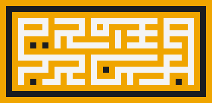

Protea will be a multi-platform and multi-purpose programming language containing tools you need for building, testing and deploying apps, systems and libraries for the entire tech stack. It supports the object-oriented and functional programming paradigms, and allows you to write simple, fast and quality type safe code while leveraging huge ecosystems of libraries.

```dart
module Button {
  style button {
    color: palevioletred
    font-size: 1em
    margin: 1em
    padding: 0.25em 1em
    border: 2px solid palevioletred
    border-radius: 3px
  }

  pub compo make(&count: int) {
    var times = match count {
      case 1: "once"
      case 2: "twice"
      case 3: "$n%d times"
    }
    var msg = "Click me $times%s"
    <button>$msg</button>
  }
}
```

### Overview

Protea is both a programming language and a framework targeting the JavaScript ecosystem, optimized for building, testing and deploying cross-platform applications using only a single programming language. It is heavily inspired by Scala, Rust, Go, Python, ReasonML and the React framework.

### Syntax Overview

Protea is heavily inspired by Scala on many regards, including pattern matching, classes, traits, variables and operators. Protea has many short keywords, such as `dyn`, `pub`, `priv` and `impl`, many of them inspired from Rust.

```dart
data Vec(x: float, y: float) {
  infix func + (that: Vec) = Vec(x + that.x, y + that.y)
}

val vector1 = Vec(1.0, 1.0)
val vector2 = Vec(2.0, 2.0)
val vector3 = vector1 + vector2
vector3.x // 3.0
vector3.y // 3.0
```

The influence from Go can be seen in the syntax for variable declarations, most language constructs that are free of syntax noise like semicolons and parentheses, and statements like `go` and `defer`. Protea uses the `[]Item` syntax for list types.

```dart
func fibonacci(n: int): []int {
  var (a, b) = (1, 1)
  for var i in 1 to n { (a, b) = (b, a + b) }
  return list
}

func fibonacci(n: int): int = match n {
  case is 0 | 1: 1
  case n: fibonacci(n - 1) + fibonacci(n - 2)
}
```

Protea still maintains a general syntax that still somewhat resembles JavaScript, and has inherited most of the features such as JavaScript, adapted for the language. Protea also has support for SCSS, JSDoc, JSX and limited support for GraphQL.

```dart
val element = <div>
  <h1>Hello!</h1>
  <h2>Good to see you here.</h2>
</div>

var TomatoButton = style Button {
  color: tomato
  border-color: tomato
}

data HeroNameAndFriends(episode: Episode) {
  hero(episode) {
    name
    friends {
      name
    }
  }
}
```

Protea also contains some smaller influences from other languages like Ruby, with symbol literals, Python's array slicing and splash asterisk, and YAML single quoted raw strings.

### Help me choose a language name!

- Dictionary words
  - **Solace**, i.e. comfort, peace
  - **Zenith** or **Nadir**
  - **Zephyr**
  - **Protean** or **Proteus**
- Personal names
  - **Evalyn** or **Evalin**
- Flora or Fauna
  - **Protea**
  - **Lotus**

### Features (non-exhaustive, more to come)

- familiar syntax (for the most part)
- JSDoc support
- JSX and embedded CSS support
- GraphQL schemas
- language-integrated query (LINQ)
- tagged template literals
- keyword-based syntax
- concurrency/asynchrony support and error-handling
- pattern matching
- type annotations and aliases
- uniform function call syntax
- immutable-by-default data structures
- block regular expressions
- extensible numeric literals
- string formatting
- Unicode named characters
- algebraic data types
- advanced type inference
- Node.JS runtime
- multiple targets: JS, C#, Python, JVM and LLVM/Swift
- opaque types and type aliases

### Compiler features (for future use)

- full tail call elimination
- human friendly errors
- what compiler should I use to build Protea?
- a core standard library
- an interactive REPL
- comprehensive editor support

## An Introduction

A typical Protea project would contain this file structure:

```
hello-world/
|- lib/ -> all installed modules
|- src/ -> backend codes
|- app/ -> frontend codes
|- node_modules/ -> required in a JavaScript project
|- .gitignore
|- index.pr
|- package.json -> required in a JavaScript project
|- README.pr
|- modules.pr
```

Modules form the core of every Protea project. They can be accessed, installed, loaded, and passed around to and from other modules.

You can put virtually anything into a module file, including constants, variables, types, functions, classes, components, constants, and more.

The entry point of a project is the `main` function, defined in a special file called `index.pr`, at the project's root directory. All code is executed within `main`.

```dart
func main {}
```

The `main` function can accept arguments:

```dart
func main(*args: []str): void { /* code here */ }
```

Script files do not have a `main` function, similar to other languages. They can import and use modules, and can call and open other script files.

### Syntax

Like JavaScript, Protea is a curly-brace language. Code blocks are delimited usually with curly braces.

Semicolons are completely optional though they can be used to separate multiple statements on the same line. The same rules apply to commas in function arguments or collection literals.

If a line ends in an **infix operator**, such as `!in` or `&&`, the resultant line is joined. If the next line also begins with an infix operator, it is joined to the previous line.

```dart
x in // joined
y

x // joined
in y
```

### Comments

Protea supports C-style comments. Block comments can be nested. The leading spaces after a comment is required, but not the trailing spaces.

```dart
// line comment
/* /* block comment */ */
/// line documentation comment
/** block documentation comment */
```

### Variables

A variable binding, or otherwise a declaration, begin with any one of `var`, `val`. All bindings are "scoped" to the block in which they are defined in, and all inner blocks.

```dart
var x = 42
val y: int = 42
y = 10
```

### Assigning multiple variables

There are many ways to assign variables:

```dart
var x, y, z = 1, a = 2
x = 1; y = 2
```

You can also unpack them from regular expressions or data structures:

```dart
val `(?'x'.+)` = 'a' // x == 'a'
val (x, y) = (1, 2) // seq
val [x, y] = [1, 2] // list
val {x, y} = {x: 1, y: 2} // map
val {x, y} = {1, 2} // set
```

### Keywords

Protea has a lot of different types of keywords, all of which are written entirely in lowercase and are between two and six letters.

Keywords used as operators:

```
in of as is new
to til thru by del
unset ref and or xor not
```

Declaration keywords, which are keywords used to declare program entities such as variables, functions, methods and properties.

```
var val func proc type
class data enum module
iter macro struct object
trait style elem prop
```

Control keywords are keywords used to create control flow statements such as conditionals, loops and error-handling statements.

```
do from where
if elif else
for each loop while
try throw catch after
match case goto pass
break next redo retry
return yield await label
import export route
debug assert
```

Contextual keywords are only parsed as keywords when they appear before a declaration keyword and occur in a row.

Visibility keywords explicitly tell the compiler which qualified name to refer to in a given scope. It would also be used to

```
# Visibility and mutability
pub priv prot after mut immut
glo loc early late covar contra
seal abst inter exter imply exply
super

# Concurrency/thread modifiers
sync async stat dyn lazy eager bound free

# Function or method modifiers
rec gen oper get set post del curry inline
prefix suffix infix binary unary left right
```

### Identifiers

An identifier can contain any sequence of letters, digits, marks,underscores, and dashes, provided it starts with a letter or underscore, and does not end in any number of dashes.

```js
const regex = /\b[\p{Pc}\p{L}][\d\p{L}\p{M}\p{Pc}\p{Pd}]*\b/;
```

Identifiers are compared using an approach known as partial case-insensitivity.

```dart
func cmpIdent(a: str, b: str): bool {
  val a1
  if (a1 = a.sub(`\P{Alnum}`g, '')) ~= `\p{Upper}+`:
    a1 == b.sub(`\P{Alnum}`g, '')
  else:
    a[0] == b[0] && (
      a[1:].sub(`\P{Alnum}`g, '').lower() ==
      b[1:].sub(`\P{Alnum}`g, '').lower()
    )
}
```

To "strop" keywords, append a trailing underscore.

```dart
type Type = { def_: Func }
var var_ = 42, val_ = 8
val assert_ = var_ + val_ == 50
assert assert_
```

All identifiers are normalized using the above function.

### Booleans, Null and Void

The `null` type is used to represent the absence of a value, similar to that in other languages. It only has a single value:

```dart
null
```

Protea also has `void`, for compatibility purposes. `void` is equal to `null`, but compiles to JavaScript `undefined`. You should use `void` in place of `null`.

Booleans have only two possible values: `true` and `false`. They are constructed using the following literals:

```dart
true
false
```

### Numbers

Protea supports three numeric data types, `Nat`, `Int` and `Float`, all 64-bit. This avoids a lot of complexity associated with numeric precision such as file lengths, Unicode strings or very large lists.

```dart
val integer: int = 123
val floating: float = 0x12.345
```

As for signs, the prefix `+` and `-` are not part of the literal.

Numbers are case insensitive. They can contain leading zeroes or underscores for easy readability. Literals can be written in base 2, 4, 6, 8, 10, 12 or 16:

```dart
val base2 = 0b10
val base4 = 0q123
val base6 = 0s12345
val base8 = 0o1234567
val base10 = 0123456789
val base12 = 0z0123456789ab
val base16 = 0x0123456789abcdef
```

Floating-point numbers can allow different kinds of delimiters and separators.

```dart
0.3 // Basic literal (3/10)
3/10 // Fraction
0.~3 // Repeating digits
1^10 // Exponent
1^-10 // Signed exponent
0.1*16^+10 // Scientific notation
1=10 // Rounding to 10 decimal places
1=+10 // Round up 10 decimal places
1=-10 // Round down 10 decimal places
1=!10 // Round to 10 significant figures
1=!+10 // Round up to 10 significant figures
1=!-10 // Round down to 10 significant figures
```

The fractional, repeating, exponent, rounding and type-suffix part appear in that specific order, though are all optional.

Multi-base digits can use either alphanumerics or digits. The digits are specified with a formatting modifier, `%`.

```dart
var int: int = 123
var nat: nat = 123:u
var float: float = 123.0

/* Different radixes */
val base2 = 0b10
val base4 = 0q123
val base6 = 0s12345
val base8 = 0o1234567
val base10 = 0123456789
val base12 = 0z0123456789ab
val base16 = 0x0123456789abcdef

/* For floats only: */
0.3 // Basic literal (3/10)
3/10 // Fraction
0.~3 // Repeating digits
1^10 // Exponent
1^-10 // Signed exponent
0.1*16^+10 // Scientific notation
1=10 // Round to 10 decimal places
1=+10 // Round up 10 d.p
1=-10 // Round down 10 d.p
1=!10 // Round to 10 significant figures
1=!+10 // Round up to 10 s.f
1=!-10 // Round down to 10 s.f

// Parts of a float: all optional
/* fraction => repeating => exponent => rounding => suffix */
/* denominator => exponent => rounding => suffix */

// Type suffix: with colon
assert 1:u is nat

// Multi-base literals
val base100 = 100b0_99_99
assert base100 == 9999

// With custom digits
const base17Digits = '0123456789abcdefg'
val base17 = 17b0123456789abcdefg%num/digits:(base17Digits)
```

Integers:

- Comparisons: `<=`, `<`, `==`, `!=`, `>=`, `>` (evaluate to bool)
- Bit operators: `&`, `|`, `^` (bitwise exclusive or), `~` (bitwise negation)
- Shift operators: `<<` (left shift), `>>` (right shift)
- Arithmetic operators: `+`, `-`, prefix `-` (only for signed integers), `*`, `/`, `%` (modulo), `**` (exponentiation)

### Strings

Strings are created using single or double quotes. They are stored as UTF-16.

```dart
'all single quoted strings are verbatim'
'this \ backslash also does not need to be escaped'
'same for the " double quote'
'to express one single quote, use '' two of them'

"here we can use predefined escape sequences like \t \n \b"
"or generic escape sequences \x0b \u0041 \U000041"
"the double quote \" needs to be escaped"
"just like the \\ backslash"
"the single quote ' and other characters can be escaped,
but they are completely optional"
" more quotes because why not"""""
```

Double quoted string literals can contain the following escape sequences, and all of them are case-insensitive:

```dart
"\p" // platform specific newline
"\r" // carriage return
"\n" // newline
"\f" // form feed
"\t" // horizontal tab
"\v" // vertical tab
"\a" // alert (bell)
"\b" // backspace
"\e" // escape
"\s" // space
"\cA" // control character from A (#U+01) to Z (#U+1A)

// Multi-base escapes
"\b100001111111111111111"
"\q10033333333"
"\s35513531"
"\o4177777"
"\d1114111" // or "\1114111"
"\z4588A7"
"\x10FFFF" // or "\u10fffff"

// Multi code-point escapes
"\x48\x45\x4c\x4c\x4f" == "\x{48 45 4c 4c 4f}"
"\d{72 69 76 76 69}" == "\72\69\76\76\79"

// LaTeX expressions:
"\j{
  \documentclass{article}
  \title{Cartesian closed categories and the price of eggs}
  \author{Jane Doe}
  \date{September 1994}
  \begin{document}
    \maketitle
    Hello world!
  \end{document}
}"
```

Multi-quoted strings are defined with three or more quotes of the same type and end in the same opening sequence.

```dart
// All non-spacing characters are discarded
// between the text and the quotes
'''We're fine'''
""""We're fine""""

// Strings can end in more than the opening number of quotes
"""x""""

// Indentation is preserved or discarded
// based on the first line of text
'''
"stringified
  string"
''' ==
"""
  "stringified
    string"
"""

// Escaping rules apply as before
'''
  no escapes needed!
'''
"""
  \\escape\ with\ me
"""
```

### String interpolation (`$`)

All forms of strings can allow interpolation. Expressions are always prefixed with the dollar sign and may be surrounded with curly brackets.

If the expression is an identifier or qualified name, a nested property or a function or method call, then the brackets can be left out. Use the `\$` escape sequence if you wish to express the dollar sign itself.

```dart
"simple $variable"
"$object_.property or $deeply.nested[property]"
"$type_{casting}"
"$a.'string'.property"
"$function() or $method.call(plus, params)"
"${expression} if all else fails"
"keywords $then are not stropped"

'$1' '$%' // don't need escaping
'$$a' == "\$a"
```

### String formatting

Protea comes built-in with a string formatting mini-language for converting, serializing and transforming objects inside strings, with a clearer to read syntax. They are composed of the following parts:

- A type: `%type` denoted by a percentage sign
- An optional range of switches, each denoted by a slash `/switch`,
- Their optional values, separated by a colon: `/sw:value`.

```dart
"%type/switch/switch:'value'/switch:(expression)"

// Types of values
"%x/x:#10ffff numeric (positive only)"
"%x/color:blue CSS property"
"%x/x:other variable"
"%x/x:'' string"
"%x/x:`` regex"
"%x/x:() expression"
"%x/x:[] array"
"%x/x:{} dictionary"

'%1' '%$' // don't need escaping when next to a symbol or number
'%a' == "\%a"

const Everest = {height: 8848}
"Mount Everest is $Everest.height%f/unit:m/style:long tall."
// "Mount Everest is 8,848 meters tall."
```

### String placeholder variables

String placeholders are used to create template strings from named, keyed or positional arguments. They produce strings from their arguments by calling its `format` method with the specified arguments.

```dart
"#named" "#?optional"
"#&keyed" "#%optional"
"#0 positive (zero-indexed)"
"#-1 negative (from end)"
"#*spread (from an object)"

'#@' '#*' // don't need escaping when next to a number
'%a' == "\%a"

// Usage
"#1%s".format(0, "hello world") // => 'hello world'
"#&int%i/b:16/p:'0x'".format({int: 42}) // => '0x2A'
"#name%i/b:16/p:'0x'".format(name = 42) // => '0x2A'
```

### Symbols

A symbol represents a unique name inside the entire source code. Symbols are interpreted at compile time and cannot be created dynamically.

The only way to create a symbol is by using a symbol literal, denoted by a colon (`:`) followed by an unquoted string beginning with a word character, and follows the same rules as an unquoted string.

The identifier may optionally be enclosed in single or double quotes.

```dart
:unquoted_symbol
:"quoted symbol"
:"a" // identical to :a
:あ
```

A quoted identifier can contain any Unicode character including white-spaces and can same escape sequences as a string literal, including interpolation. Use interpolation to create dynamic keys.

```dart
:question?
:exclamation!
```

### Regular expressions

Regular expressions function like strings, except delimited using backticks. In an effort to make them more readable, Protea's regexes allow for free spacing and embedded comments.

Protea uses the [Oniguruma](https://github.com/kkos/oniguruma/blob/master/doc/RE) regular expression flavor by default, the same regex engine that powers Ruby and PHP7. This means it's a blend of features found in the most popular regular expression flavors.

````dart
`\b{wb}(fee|fie|foe|fum)\b{wb}`x
`[ ! @ " $ % ^ & * () = ? <> ' : {} \[ \] `]`x
`
// Match a 20th or 21st century date in yyyy-mm-dd format
(19|20)\d\d                // year (group 1)
[- /.]                     // separator
(0[1-9]|1[012])            // month (group 2)
[- /.]                     // separator
(0[1-9]|[12][0-9]|3[01])   // day (group 3)
`

// Multi-quoted regex
```(?:[a-zA-Z_]|(?:\\u[0-9a-fA-F]{4}|\\U[0-9a-fA-F]{8}))(?:[a-zA-Z0-9_]|(?:\\u[0-9a-fA-F]{4}|\\U[0-9a-fA-F]{8}))*(?=:)```
````

Interpolation and formatting also applies but the interpolated result is usually escaped so to prevent generating invalid regular expressions.

#### Replacement strings

If there are two adjacent regular expression literals on one side, then the one on the right is the substitution (template) string for the regular expression on the left.

```dart
val str = 'James Bond'
val newStr = str.sub(`(\w+)\W+(\w+)` `$2, $1`) // 'Bond, James'
val newStr = str.sub(`(\w+)\W+(\w+)` `My name is $2, $0!`)
// 'My name is Bond, James Bond'

`` `
$& $0   ${/* Entire match */}
$-      ${/* Before matched substring */}
$+      ${/* After matched substring */}
$1      ${/* Numbered capture group */}
$+1     ${/* Relative group */}
$<name> ${/* Named capture group */}
`
```

### Collections

Protea comes with two basic literals: list and map. Both collections are homogenous and immutable.

- Lists are ordered collections of literals.
- Maps are collections of key-value pairs where each item is mapped to a distinct key.

Sets are map literals with the values repeated.

```dart
var list1: []int = [10, 20, 30]
var list2 = ['a', 'b', 'c'] // is []str
[] // an empty list

val map1: {str : int} = {one: 1, two: 2, three: 3}
val map2 = {1: 2, 2: 4, 3: 6, 4: 8} // inferred as {int : int}
{} // an empty map
```

An explicit type can be specified by immediately following the closing angle with a type encased in curly brackets, without a space.

This overwrites the inferred type and can be used for example to create an array that holds only some types initially but can accept other types later.

```dart
var z = [10, '20', '30']{Str | Int} // with type casting operator
```

Often the compiler will infer a list to have a non-nullable type. If the list might store `null` values, then you will need to explicitly cast it.

```dart
[1, 2, 3] // cannot store null
[1, 2, 3, null]{?Nat} // can store null
```

The empty list is denoted using the special syntax `[]`. Often you will specify a type - for example `[]{Str}` is an empty list of strings. If a type is not specified, then the empty list is an `[]{Any}`.

If a key is a valid identifier, even if it is a keyword, and is placed right before the colon, then it need not be quoted. The same goes for types. Any other value is parsed as an expression. Unquoted identifiers are subject to normalisation.

```dart
x = {int: 1, 2.2: 2, '3': 3, x * 2 + 4: 4}
assert x.int == 1
assert x.2.2 == 1 // but why tho
assert x.'3' == 3
assert x[x * 2 + 4] = 1
```

Map literals with single elements are allowed, with the keys and the values repeated.

```dart
assert ({1: 1, 2: 2}) == {1, 2}
```

## Expressions & Operators

In Protea, operators are methods. Any method with a single parameter can be used as an infix operator. For example, `+` can be called with dot notation:

```dart
10.+1
```

However, it’s easier to read as an infix operator:

```dart
10 + 1
```

The data class `Vec` has a method `+` which we used to add vector1 and vector2. Using parentheses, you can build up complex expressions with readable syntax.

```dart
data Vec(x: float, y: float) {
  func + (that: Vec) = Vec(this.x + that.x, this.y + that.y)
}

val vector1 = Vec(1.0, 1.0)
val vector2 = Vec(2.0, 2.0)
val vector3 = vector1 + vector2

vector3.x // 3.0
vector3.y // 3.0
```

Operators can contain the following characters. In addition, all other Unicode punctuation and symbol characters can also be used as operators.

```dart
'
= + - * / \ < >
@ $ ~ & % | ! ? ^ . :
'
```

These keywords are also operators: `in !in of !of is is! as as! as? unset del to til thru by and or xor not !and !or !xor`.

`.`, `=`, `:`, `::`, `|>`, `||>`, `|||>`, `+>`, `<|`, `<||`, `<|||`, `<+`, `?:`, `!:`, `??`, `!!`, are not available as general operators; they are used for other notational purposes.

An infix operator can contain any sequence of `//` or `/*`, but must NOT be exactly those sequences (those are the syntax for comments).

Infix operators whose first character is `@` are right-associative.

```dart
func x @/ (y: float): float = x / y
12 @/ 4 @/ 8 // 24.0
12 / 4 / 8 // 24.8
```

Prefix, suffix and infix operators are distinguished whether they have preceding, following whitespace, or both (respectively).

Suffix operators are evaluated first and from left to right, and prefix operators are evaluated next and from right to left.

Infix operators are evaluated last and are evaluated based on the given order below.

###

Operators ending in either `->`, `~>` or `=>` or starting in `<-` `<=` or `<~` are called arrow like, and have the lowest precedence of all operators.

If the operator ends with `=` and its first character is none of `<`, `>`, `!`, `=`, `~`, `?`, it is an assignment operator which has the second-lowest precedence.

Otherwise, precedence is determined by the first character.

| Precedence level | Operators                                                        | First character |
| ---------------- | ---------------------------------------------------------------- | --------------- |
| 9 (highest)      | `unset del not`                                                  | `$ ^`           |
| 8                | `* / ** # %`                                                     | `* % \ /`       |
| 7                | `+ -`                                                            | `+ - ~ \|`      |
| 6                | `& \| ^ << >>`                                                   | `&`             |
| 5                | `== <= < >= > != in !in of !of is is! as as! as? to til thru by` | `= < > !`       |
| 4                | `&& \|\| ^^ and or xor`                                          |                 |
| 3                | infix `?? !! ?: !: ::`                                           |                 |
| 2                | `@` and arrow like operator (like `->`, `=>`)                    |                 |
| 1                | assignment operator (like `+=`, `*=`)                            |                 |

Whether an operator is used as a prefix operator is also affected by preceding or following whitespace, respectively.

```dart
++x++ == +(+((x+)+))
```

Dot-like or colon-like operators are operators starting with `.`, `!.`, `?.`, `::`, `?:` or `!:`; they have the same precedence as `.`, so that `a.?b.c` is parsed as `(a.?b).c` instead of `a.?(b.c)`.

---

## Control Statements

Protea has a range of control statements which are also expressions. They form the core of the language.

### Basic closures

Bindings can be scoped through the do-block: `do {}`. The value of the last line of a closure is immediately returned, lest specified with `return`.

```dart
val message = do {
  val part1 = "hello"
  val part2 = "world"
  part1 ++ " " ++ part2
}
// `part1` and `part2` not accessible here!
```

`if`, `while`, and all code blocks use this same mechanism.

```dart
if displayGreeting {
  val message = "Enjoying the docs so far?"
  print(message)
}
// `message` not accessible here!
```

Instead of a block, whenever there's a single statement, you can use a colon `:` instead of an opening curly brace, provided the colon is separated by a space only on its right.

```dart
val message = do: 3 + 4
val message = do : 3 + 4 // type annotation
```

But not both (opening curly brace is a map literal).

```dart
val message = do: { 3 + 4 }
assert message is map
```

### Conditionals

A basic `if` statement looks like this:

```dart
if a == b: doSomething()
```

Or like this:

```dart
if a == b:
  doSomething()
```

or even like this:

```dart
if a == b {
  doSomething()
}
```

An `if`-`else` expression without the after `else` branch gives null.

```dart
if showMenu { displayMenu() }
// is equivalent to
if showMenu { displayMenu() } else { null }
```

The `if`-`else` construct looks like this:

```dart
if a == b {
  doSomething()
} else {
  doSomethingElse()
}
```

The complete `if`-`else if`-`else` expression looks like this:

```dart
if test1 {
  doX()
} elif test2 { // not "else if"
  doY()
} else {
  doZ()
}
```

A great thing about the conditional is that it always returns. You can ignore the result as we did in the previous examples, but a more common approach, especially in functional programming.

You can assign the result to a variable:

```dart
val minValue = if a < b: a else: b
```

Anyway, Protea has two ternary conditional operators, which are just syntax sugar for the above if you're not keen on using `if`. That last one, is syntax sugar for `un`...`else`.

```dart
val minValue = a < b ? a : b
val maxValue = a > b ! a : b
```

### For-loops

In its most simple use, a `for` or `each` loop can be used to iterate over the elements in a collection. For example, given an array of integers:

```dart
val numbers = [1, 2, 3]
```

you can loop over them and print out their values like this:

```dart
for val n in numbers: print(n)
```

A second variable is assigned to their indices (i.e keys):

```dart
for val number, index in numbers: print(n, x)
```

You can loop over the keys of a map (or any other keyed collection) with `of` rather than `in`.

```dart
val list = [4, 5, 6]
for val i in list:
  print(i) // "0", "1", "2",
for val i of list:
  print(i) // "4", "5", "6"
for val n of numbers: print(n)
```

### While Loops

While loops execute its body code block while its condition is true.

```dart
while i < 10 {
  text += "The number is $i"
  i += 1
}
```

`loop-while` is a variant of `while`. This loop will execute the code block once, before checking if the condition is true, then it will loop the loop as long as the condition is true.

```dart
loop {
  text += "The number is $i"
  i += 1
} while i < 10
```

Loop blocks without their while condition would run indefinitely, and you would have to manually insert a `break` statement somewhere. Loop blocks would also stop executing when a closure returns, yields or throws too.

```dart
loop:
  print("hello world forever!")

val i = 1
loop {
  print("i is now $i")
  if i > 100: break
  i *= 2
}

assert i == 128
```

#### Loop keywords

Protea has three keywords relating to loops:

- stop and exit a loop or an enumeration using the `break` keyword
- jump to the next iteration or step using the `next` keyword
- redo the current iteration or step using the `redo` keyword

```dart
label x loop {
  if new Random() > 0.3: break x
  elif new Random() > 0.5: next x
  elif new Random() > 0.7: redo x
  else: log("Still running")
}
```

All are system calls so they can be interlaced with expressions.

### Match or match

With a `match` or `switch` expression you write a number of case statements that you use to match possible values.

`match`/`switch` expressions are nice because they also return values, so rather than directly printing a string as in that example, you can assign the string result to a new value:

```dart
// i is an integer
val dayName = match i {
  case 1: "Monday"
  case 2: "Tuesday"
  case 3: "Wednesday"
  case 4: "Thursday"
  case 5: "Friday"
  case 6: "Saturday"
  case 7: "Sunday"
  fail: "Invalid day"
}
```

`match`/`switch` expressions allow you to handle multiple cases.

To demonstrate this, imagine that you want to evaluate "boolean equality" like PHP would: `0`, `''` or `'0'` evaluates to `false`, while everything else evaluates to `true`.

```dart
func isTrue(a: Any) = match a {
  case is 0 | '' | '0': false
  fail: true
}
```

The key part of this solution is that this one case statement lets both 0 and the empty string evaluate to false:

```dart
match a { case is 0 | '' | '0': false }
```

Before we move on, here’s another example that shows many matches in each case statement:

```dart
val evenOrOdd = match i {
  case is 1 | 3 | 5 | 7 | 9: print("odd")
  case is 2 | 4 | 6 | 8 | 10: print("even")
  fail: print("some other number")
}
```

Here's another example that shows how to handle multiple strings in multiple case statements:

```dart
match cmd {
  case is "start" | "go": print("starting")
  case is "stop" | "quit" | "exit": print("stopping")
  fail: print("doing nothing")
}
```

#### Guard conditions

Another great thing about match expressions is that you can use `if` clauses to filter conditions.

```dart
val number = 4:u
match number {
  case i if i == 0: print('Zero')
  case i if i > 0: print("Greater than zero")
  fail: print("Fell through")
}
```

#### Bindings

Indirectly accessing a variable makes it impossible to branch and use that variable without re-binding. The `as` clause for binding values to names:

```dart
val pair = [2, 2]

match pair {
  case [x, y] as z if x == y: print("$z are twins!")
  case [x, y] as z if x + y == 0: print("$z are opposites!")
  case [x, _] if x % 2 == 1: print("The first is odd.")
  fail: print("Nothing special!")
}
```

Matching on strings, regular expressions and functions using interpolation would allow you to extract those data from them.

```dart
val sample: str = '10-a'
match sample {
  case '${x: int}-dir': exec(x)
  case `(?<x>\d+)-dir`: exec(x)
  case |x| ~= `^\d+-dir$`: exec(x)
}
```

### Error handling

Like a lot of other languages, Protea has a try-catch statement to val you catch and manage errors. The main difference is that Protea allows you to pattern match errors.

```dart
var text = ''
try:
  text = new File('filename').open().read()
catch {
  case is FileNotFoundError:
    "Could not find the file $filename"
  case is IOError:
    "Had an IOError trying to read file $filename"
}
```

Try-catch also lets you use an `after` clause which is typically used when you need to close a resource.

```dart
try {
  var file = file(path).open().read()
} catch {
  case foo : FooError: handleFooError(foo)
  case bar : BarError: handleBarError(bar)
  case : Throwable: print("Got some other kind of \
    Throwable error")
} after {
  file.close()
}
```

You can also use a `with` clause similar to Python, so there is no need to write a `final` clause, or even a `catch` clauses. Those are defined with the trait `Handleable`, with the methods `_try`, `_catch` and `_after` defined.

```dart
with var file as new File(path).open.read {
  file.write('hello world!')
} // after { file._final() }
```

### Concurrency and Multi-threading

Other concurrent processes are managed through processes as defined in the `Thread` module.

## Functions

Functions form the heart of Protea. Writing them is very simple:

```dart
func double(i: int): int = i * 2
```

Impure functions use the `proc` (procedure) keyword instead of `func`. This is sure to distinguish them from regular pure functions.

Functions can also be written using a special syntax that resembles Ruby, with the arguments written in between pipe characters instead:

```dart
val add = |x, y, z| x + y + z
val add = |x: int, y: int, z: int|: int = x + y + z
add(1, 2, 3) // 6
```

For longer functions, you'd surround the body with a block:

```dart
func greetMore(name) {
  val part1 = "Hello"
  part1 ++ " " ++ name
}
```

If your function has no arguments, you can write `var greetMore = | | { }`.

### Recursive Functions

By default, a function cannot be called recursively with itself. To make a function recursive, we add the `rec` modifier. Tail recursion is compiled into a fast `while` loop so they run faster.

```dart
rec func sum(list: list[int]): int = match list {
  case null: 0
  case head :: tail: head + sum(tail)
}
```

A simple recursive function may look like this:

```dart
rec func List.has(item: any): bool = match this {
  case []: false
  case [a, *rest]: a == item ?: rest.has(item)
}
```

Mutually recursive functions start like a single recursive function using the `rec` keyword, and then are chained together with `and`.

```dart
rec func callSecond = | | callFirst()
and func callFirst = | | callSecond()
```

### Labeled Arguments

Multi-arguments functions, especially those whose arguments are of the same type, can be confusing to call.

```dart
func addCoordinates(x, y) {
  // use x and y here
}
addCoordinates(5, 6) // which is x, which is y?
```

You can attach labels to an argument by prefixing the name with the `&` symbol:

```dart
func addCoordinates(&x, &y) {
  // use x and y here
}
// ...
addCoordinates(&x = 5, &y = 6)
addCoordinates(&y = 6, &x = 5)
```

The `&x` part in the declaration means the function accepts an argument labeled `x` and can refer to it in the function body by the same name.

You can also refer to the arguments inside the function body by a different name for conciseness:

```dart
func addCoordinates(&x as y) {
  // use x and y here
}
```

### Optional Arguments

Labeled function arguments can be made optional during declaration. You can then omit them when calling the function.

```dart
// radius can be omitted
async proc drawCircle(&color, &?radius) {
  await setColor(color)
  match radius {
    case none: startAt(1, 1)
    case some r: startAt(r, r)
  }
}
```

You can type a `func` or `proc`. The argument is wrapped in an "option" type.

```dart
async proc drawCircle(
  circle: circle,
  &color: color
  &?radius: ?int = 1
): void {
  await color.set()
  match radius {
    case none: circle.startAt(1, 1)
    case some r: circle.startAt(r, r)
  }
}

var result =
  drawCircle(&color, &radius = ?payloadRadius)
```

Labeled arguments can also be provided a default value. In this case, they aren't wrapped in an option type.

```dart
func drawCircle(&radius = 1, &color) {
  setColor(color)
  startAt(radius, radius)
}
```

### Curried functions

Functions and procedures are curried, by default. To want guaranteed un-currying, prefix a dot in the function's parameter list. Its type would have a dot.

```dart
func add(. x, y) = x + y
assert echo is (. int, int) int
add(. 1, 2)
```

If you need to call a curried function without any argument, you can do this:

```dart
proc echo(a) = print(a)
echo(.)
```
